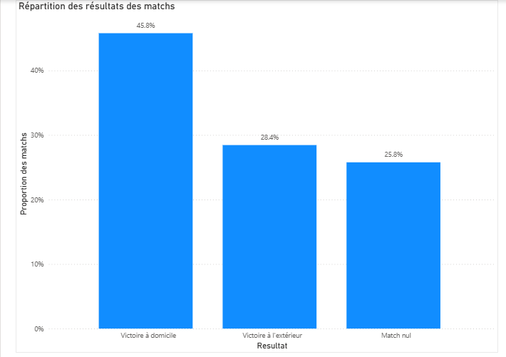
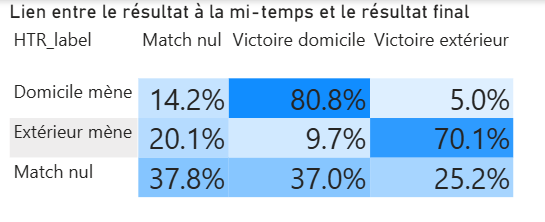
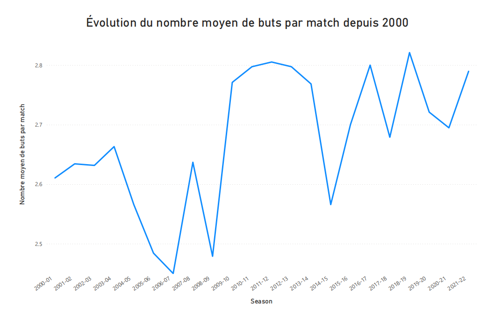
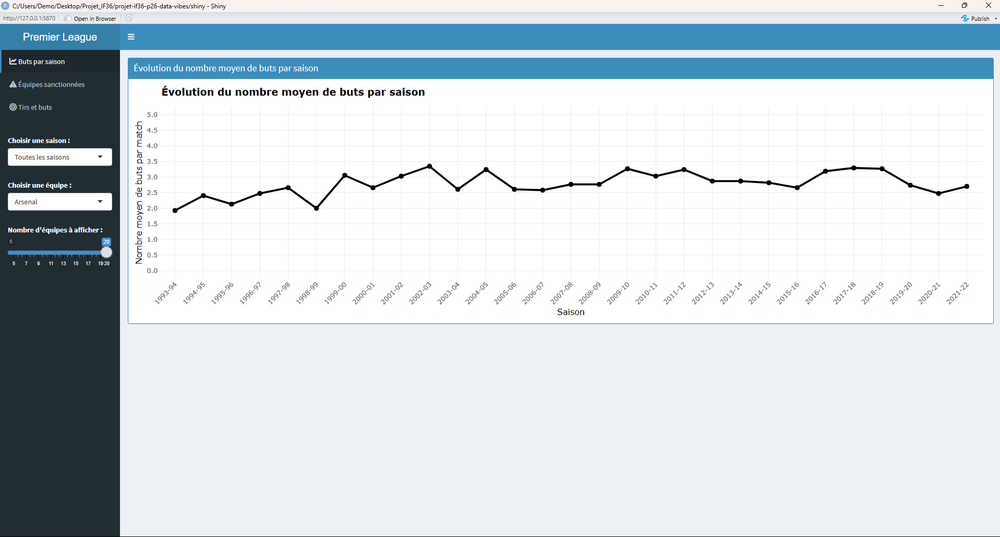
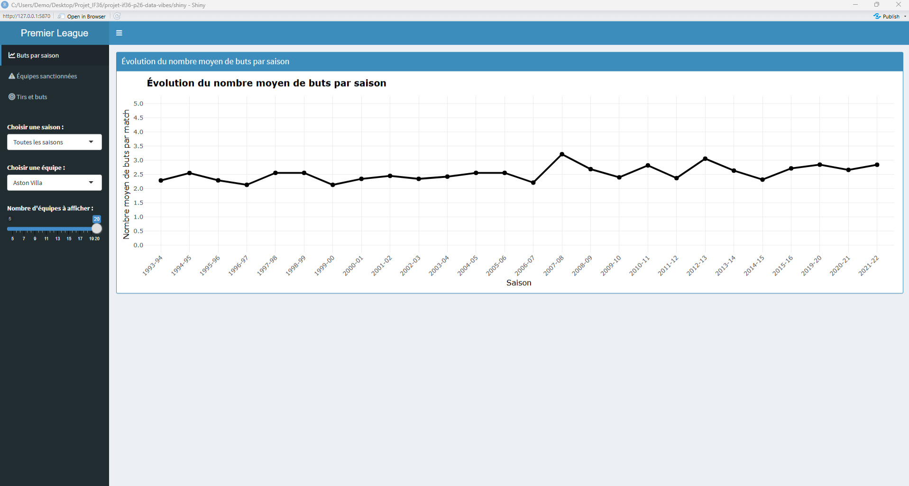
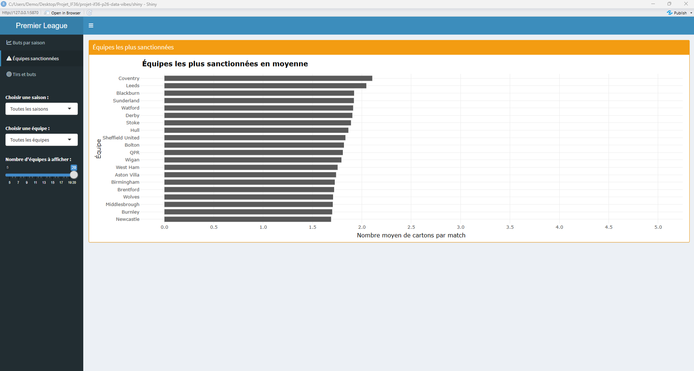
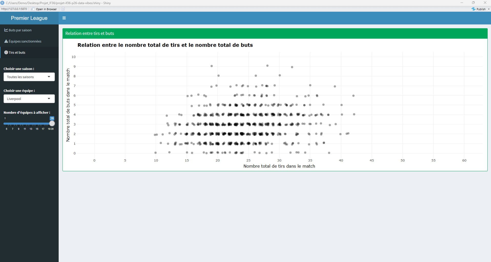

<style>
#TOC {
  font-size: 15px;
}

#TOC .tocify-header > li > a,
#TOC .tocify-header > li > .tocify-item {
  font-size: 19px !important;
  font-weight: 700 !important;
  color: #1f2d3d !important;
  padding-top: 8px !important;
  padding-bottom: 8px !important;
}

#TOC .tocify-subheader > li > a,
#TOC .tocify-subheader > li > .tocify-item {
  font-size: 16px !important;
  font-weight: 700 !important;
  color: #2f4858 !important;
  padding-left: 22px !important;
  border-left: 4px solid #8aa4b8;
  margin-left: 6px;
}

#TOC .tocify-subheader .tocify-subheader > li > a,
#TOC .tocify-subheader .tocify-subheader > li > .tocify-item {
  font-size: 13.5px !important;
  font-weight: 400 !important;
  color: #5a6470 !important;
  padding-left: 42px !important;
  border-left: none;
  line-height: 1.35;
}

#TOC .tocify-item.active,
#TOC .tocify-focus {
  background-color: #2f4858 !important;
  color: white !important;
  font-weight: 600 !important;
  border-radius: 4px;
}

#TOC .tocify-subheader .tocify-subheader .tocify-item.active,
#TOC .tocify-subheader .tocify-subheader .tocify-focus {
  font-size: 13.5px !important;
  font-weight: 600 !important;
}

#TOC li {
  margin-bottom: 4px;
}
</style>

```{r setup, include=FALSE}
knitr::opts_chunk$set(
  echo    = TRUE,
  message = FALSE,
  warning = FALSE,
  fig.align = "center",
  fig.width = 9,
  fig.height = 5
)

library(tidyverse)
library(ggridges)
library(here)
library(dplyr)
library(ggplot2)
library(readr)

epl <- read_csv(here("data", "results.csv")) %>%
  filter(!is.na(HS) & !is.na(AS)) %>%
  mutate(
    TotalGoals = FTHG + FTAG,
    TotalShots = HS + AS,
    ShotDiff   = HS - AS,
    TotalFouls = HF + AF,
    TotalCards = HY + AY + HR + AR
  )
```
# Introduction

La Premier League est l’un des championnats de football les plus suivis au monde. À travers ce projet, nous cherchons à comprendre quels facteurs peuvent être associés aux résultats des matchs : l’avantage du terrain, la dynamique du score, l’efficacité offensive, la discipline ou encore l’évolution du jeu au fil des saisons.

L’objectif de ce rapport est donc de construire une analyse exploratoire progressive à partir de visualisations de données. Chaque question est accompagnée d’un graphique, d’une interprétation et d’une discussion sur les limites des résultats obtenus.

## 1. Données

Le jeu de données étudié porte sur les matchs de Premier League anglaise et couvre plusieurs saisons (de 1993 à 2022). Il est fourni au format **CSV** et contient **11 113 observations** (matchs) et **23 variables**.

Chaque observation correspond à un match et regroupe des informations détaillées sur :

* **L'identité du match** : Saison, date, équipes à domicile (`HomeTeam`) et à l'extérieur (`AwayTeam`).
* **Les scores** : Buts à la mi-temps (`HTHG`, `HTAG`) et au coup de sifflet final (`FTHG`, `FTAG`).
* **Les statistiques de jeu** : Nombre de tirs (`HS`, `AS`), tirs cadrés (`HST`, `AST`), fautes commises (`HF`, `AF`), corners (`HC`, `AC`) et l'identité de l'arbitre (`Referee`).
* **La discipline** : Cartons jaunes (`HY`, `AY`) et cartons rouges (`HR`, `AR`).

Le dataset est structuré de manière à permettre une analyse comparative entre les performances à domicile et à l'extérieur, ainsi qu'une étude de l'évolution des statistiques de jeu sur près de trois décennies.

## 2. Plan d'analyse

Notre démarche d'analyse suit le cycle **Acquire > Filter > Mine > Refine** afin de transformer les données brutes en informations exploitables :

1. **Acquire & Filter (Traitement avec dplyr)** : Nettoyage des données, gestion des valeurs manquantes (`NA`) et création de variables calculées (comme le total de buts ou le cumul des cartons) pour garantir la fiabilité des analyses.

2. **Mine (Exploration statique avec ggplot2)** : Répondre à des questions ciblées pour valider nos hypothèses. Nous avons exploré plusieurs axes :
    * **La performance** : Existe-t-il un avantage réel à jouer à domicile ? Quelles sont les équipes les plus prolifiques ?
    * **La discipline** : Existe-t-il une relation entre les fautes et les cartons ? Les arbitres influencent-ils la sévérité du jeu ?
    * **La prédiction** : Le score à la mi-temps permet-il d'anticiper avec fiabilité le résultat final ?

3. **Refine (Interactivité avec Shiny)** : Transformer ces visualisations en outils interactifs pour permettre à l'utilisateur de filtrer les résultats par saison ou par équipe, offrant ainsi une vision plus granulaire des données.

Nous portons une attention particulière au **Data-to-Ink ratio** et au **Lie Factor** (concepts vus en cours) afin de garantir que nos graphiques soient à la fois lisibles et honnêtes.

# Analyse exploratoire

## 1. Comprendre les résultats du championnat

### Question 1 — Existe-t-il un avantage du terrain ?

#### Hypothèse

Nous supposons que les équipes jouant à domicile obtiennent une proportion de victoires plus élevée que les équipes jouant à l’extérieur. Cette hypothèse repose sur l’idée que le fait de jouer à domicile peut constituer un avantage : les équipes bénéficient du soutien de leurs supporters, connaissent mieux leur stade et peuvent être moins affectées par les déplacements.

#### Choix de la visualisation

Nous utilisons un diagramme en barres pour comparer les proportions de victoires à domicile, de matchs nuls et de victoires à l’extérieur.

Cette question relève d’un objectif de comparaison et de répartition, car nous cherchons à comparer la fréquence des différents résultats possibles. La variable étudiée, le résultat final du match, est une variable nominale composée de trois catégories : victoire à domicile, match nul et victoire à l’extérieur.

Le diagramme en barres est adapté à ce type de données, car il permet de comparer des catégories nominales à partir d’une valeur quantitative, ici la proportion des matchs. L’encodage visuel par la longueur des barres facilite une lecture rapide et une estimation relativement précise des écarts entre les catégories. Ce choix s’appuie sur les principes de perception graphique et de magnitude estimation : la longueur est un encodage plus fiable que la surface ou l’intensité de couleur pour comparer des valeurs.

```{r, echo=FALSE, message=FALSE, warning=FALSE}
home_adv <- epl %>%
  count(FTR) %>%
  mutate(
    proportion = n / sum(n),
    Resultat = recode(
      FTR,
      "H" = "Victoire à domicile",
      "D" = "Match nul",
      "A" = "Victoire à l'extérieur"
    )
  )

ggplot(home_adv, aes(x = Resultat, y = proportion)) +
  geom_col(width = 0.7) +
  scale_y_continuous(labels = scales::percent_format(accuracy = 1)) +
  labs(
    title = "Répartition des résultats des matchs",
    subtitle = "Premier League, 1993-2022",
    x = NULL,
    y = "Proportion des matchs"
  ) +
  theme_minimal(base_size = 12) +
  theme(
    plot.title = element_text(face = "bold", size = 14),
    plot.subtitle = element_text(size = 11, color = "grey40"),
    axis.text.x = element_text(angle = 15, hjust = 1),
    panel.grid.minor = element_blank()
  )
```

#### Analyse des résultats

Le graphique montre que les victoires à domicile représentent la catégorie la plus fréquente parmi les résultats des matchs. Les victoires à l’extérieur sont moins nombreuses, tandis que les matchs nuls occupent une position intermédiaire.

Cette différence indique que les résultats ne sont pas parfaitement équilibrés entre domicile et extérieur. La visualisation permet donc d’identifier rapidement une tendance générale : les équipes semblent gagner plus souvent lorsqu’elles jouent à domicile.

#### Interprétation et limites

Ces résultats confirment notre hypothèse de départ : il existe un avantage du terrain en Premier League sur la période étudiée. Cet avantage peut être interprété comme le résultat de plusieurs facteurs possibles, notamment le soutien du public, la familiarité avec le stade et l’absence de déplacement pour l’équipe à domicile.

Cependant, cette analyse reste globale. Elle montre une tendance générale, mais elle ne permet pas d’expliquer précisément les causes de cet avantage. D’autres variables pourraient influencer les résultats, comme le niveau des équipes, la saison, la forme du moment, l’adversaire rencontré ou encore l’évolution du football au fil du temps.

Pour approfondir cette question, il serait utile d’analyser si l’avantage du terrain varie selon les saisons, selon les équipes ou selon le niveau relatif des adversaires.

#### Comparaison avec Power BI

Nous avons également reproduit cette visualisation avec Power BI.

```{r, echo=FALSE, out.width='80%', fig.align='center'}

```

Le graphique réalisé avec Power BI confirme le résultat obtenu avec R : les victoires à domicile représentent la proportion la plus élevée des matchs, devant les victoires à l’extérieur et les matchs nuls.

La différence principale ne vient pas du résultat obtenu, mais de la manière de produire la visualisation. Avec R, l’ajout des pourcentages, la mise en forme et les choix graphiques sont contrôlés par le code, ce qui rend la visualisation reproductible et facilement modifiable. Avec Power BI, ces éléments peuvent être ajoutés plus directement par l’interface graphique, sans écrire de code, ce qui facilite une exploration rapide et interactive.

Cette comparaison montre que les deux outils conduisent à la même conclusion : il existe un avantage du terrain en Premier League. R est plus adapté pour une analyse reproductible et personnalisée, tandis que Power BI est plus pratique pour explorer visuellement les données et tester rapidement différentes représentations.

### Question 2 — Quelle est la distribution du nombre de buts par match ?

#### Hypothèse

Nous cherchons à comprendre comment se distribue le nombre total de buts marqués par match en Premier League.
On peut supposer que la majorité des matchs comportent un nombre modéré de buts, avec peu de rencontres très riches en buts.
Cette hypothèse repose sur le fait que le football est un sport où les buts restent relativement rares. Les équipes disposent d’un temps limité pour créer des occasions et les dispositifs défensifs réduisent souvent le nombre de buts marqués. Il est donc logique de s’attendre à une concentration des matchs autour de faibles ou moyennes valeurs de buts.

#### Choix de la visualisation

Nous utilisons un histogramme car nous cherchons à étudier la distribution du nombre de buts par match. Cette visualisation est adaptée à une variable quantitative et permet d'observer rapidement les valeurs les plus fréquentes ainsi que la forme générale de la distribution. Comme vu en cours, l'histogramme est la représentation de référence pour analyser la répartition d'une variable numérique.

```{r, echo=FALSE, message=FALSE, warning=FALSE}
# Histogramme
ggplot(epl, aes(x = TotalGoals)) +
  geom_histogram(
    binwidth = 1,
    fill = "steelblue",
    color = "black",
    boundary = 0
  ) +
  scale_x_continuous(breaks = seq(0, 10, 1)) +
  labs(
    title = "Distribution du nombre de buts par match",
    x = "Nombre total de buts",
    y = "Nombre de matchs"
  ) +
  
  theme_minimal()

```

#### Analyse des résultats

L'histogramme montre que la majorité des matchs se concentrent entre 1 et 3 buts.

On observe une diminution progressive du nombre de matchs lorsque le nombre total de buts augmente, ce qui indique que les rencontres très riches en buts restent rares.

La distribution est asymétrique à droite, avec quelques valeurs élevées mais peu fréquentes.

Ainsi, le graphique est cohérent avec notre hypothèse initiale : les matchs de Premier League présentent généralement un nombre modéré de buts.

#### Interprétation et limites

Cette analyse permet de décrire la distribution générale du nombre de buts par match. Cependant, elle ne permet pas d’expliquer pourquoi certains matchs sont plus riches en buts que d’autres.

Pour aller plus loin, il serait utile de croiser le nombre de buts avec d’autres variables, comme les équipes, les saisons ou le nombre de tirs.

### Question 3 — Quelles équipes marquent le plus de buts ?

#### Hypothèse
Nous supposons que les équipes du "Big Six" : *Arsenal, Chelsea, Liverpool, Manchester City, Manchester United, Tottenham Hotspur* dominent ce classement. Ces clubs n'ont jamais été relégués depuis 1993, ce qui leur confère un avantage mécanique de longévité : plus de matchs joués signifie plus d'occasions de marquer. 
Leurs budgets élevés leur permettent également de recruter des attaquants prolifiques sur l'ensemble de la période.

#### Choix de la visualisation
Pour comparer des catégories : noms des équipes en fonction d'une valeur numérique : total de buts, le diagramme en barres horizontales est la solution la plus adaptée pour les raisons suivantes :

* **Lisibilité** : compte tenu du grand nombre d'équipes en Premier League, les noms seraient illisibles ou se chevaucheraient sur un axe horizontal (X) alors que l'orientation horizontale permet une lecture naturelle des noms de gauche à droite.
* **Optimisation du tri** : les barres sont triées de la plus grande à la plus petite et selon les principes du cours, un graphique trié réduit la charge cognitive du lecteur en lui permettant d'identifier immédiatement la hiérarchie et les extrêmes.
* **Comparaison directe** : cette représentation facilite la comparaison visuelle des longueurs de barres, mettant en évidence l'écart entre les leaders et le reste du classement.

```{r, echo=FALSE, message=FALSE, warning=FALSE}
# Préparation des données : cumuler buts à domicile et à l'extérieur par équipe
home_goals <- epl %>%
  group_by(HomeTeam) %>%
  summarise(TotalHomeGoals = sum(FTHG, na.rm = TRUE)) %>%
  rename(Team = HomeTeam)

away_goals <- epl %>%
  group_by(AwayTeam) %>%
  summarise(TotalAwayGoals = sum(FTAG, na.rm = TRUE)) %>%
  rename(Team = AwayTeam)
```

```{r, echo=FALSE, message=FALSE, warning=FALSE}
# Fusion et calcul du total
top_teams <- full_join(home_goals, away_goals, by = "Team") %>%
  mutate(GrandTotal = TotalHomeGoals + TotalAwayGoals) %>%
  slice_max(GrandTotal, n = 15)
```

Selon la sémiologie graphique de Bertin, la **longueur** est le canal visuel le plus efficace pour comparer des magnitudes confirmé par la hiérarchie de Cleveland & McGill. 
Le tri décroissant exploite l'encodage **pré-attentif de la position** sur axe commun, permettant d'identifier la hiérarchie sans effort cognitif. La couleur unique (vert foncé) respecte le **Data-to-Ink ratio** : une couleur par barre serait un encodage redondant sans valeur informative. 
La plus-value de ce graphique est de rendre visible **l'écart entre les 6 leaders et les suivants**; un écart de plus de 300 buts imperceptible dans un tableau.

On se limite au top 15 pour une meilleure lisibilité.

```{r, echo=FALSE, message=FALSE, warning=FALSE}
ggplot(top_teams, aes(x = reorder(Team, GrandTotal), y = GrandTotal)) +
  geom_col(fill = "darkgreen") +
  coord_flip() +
  labs(
    title = "Top 15 des équipes les plus prolifiques",
    subtitle = "Cumul des buts marqués (domicile + extérieur) depuis 1993",
    x = "Équipes",
    y = "Nombre total de buts"
  ) +
  theme_minimal() +
  theme(
    plot.title = element_text(face = "bold", size = 14),
    axis.text.y = element_text(size = 10)
  )
```

#### Analyse des résultats
Le graphique confirme la domination des clubs du "*Big Six*". Manchester United, Arsenal et Liverpool occupent les trois premières marches du podium.
On observe un écrat marqué entre ces leaders historiques et le reste des équipes : seules les équipes de ce haut de tableau ont inscrits un nombre de buts suprieur à 1500 buts sur la période. Cette visualisation met en évidence une hiérarchie offensive très stable sur le long terme dans le championnat anglais.
Ce résultat s'explique par le biais de longévité anticipé dans l'hypothèse : l'absence de relégation garantit un volume de matchs sans interruption. La visualisation confirme une hiérarchie offensive structurelle.

#### Interprétation et limites
Bien que ce graphique offre une vision globale efficace, il comporte certains biais qu'il est nécessaire de souligner :

* En utilisant le cumul historique des buts, nous favorisons les équipes n'ayant jamais été reléguées; une équipe très offensive présente seulement 2 ou 3 saisons en Premier League paraîtra moins "prolifique" qu'une équipe moyenne présente depuis 30 ans constituant un biais.
* Pour une analyse plus "honnête" statistiquement, il serait pertinent de comparer ces données avec la moyenne de buts par match. Cela permettrait de minimiser l'effet du temps et d'identifier les équipes réellement qui sont à craindre devant le but.
* Nous avons choisi un diagramme à barres horizontales pour garantir la lisibilité des noms de clubs; l'utilisation d'une couleur unique *vert foncé* sans gradients pour ne pas distraire l'œil des valeurs réelles
* Le graphique fige une période de 30 ans en une seule barre mais ne permet pas de voir si une équipe est en déclin offensif ou en pleine ascension sur les dernières saisons.

## 2. Dynamique des matchs

### Question 4 — Les matchs sont-ils souvent décidés en seconde mi-temps ?

#### Hypothèse

Nous supposons que la seconde mi-temps joue un rôle important dans l’issue des matchs. Après la pause, les équipes peuvent modifier leur stratégie, la fatigue apparaît et les changements de joueurs peuvent influencer le jeu.

On peut donc s’attendre à observer une proportion importante de matchs dont le résultat évolue entre la mi-temps et la fin du match.

#### Choix de la visualisation

Pour répondre à cette question, nous comparons le résultat à la mi-temps (`HTR`) avec le résultat final (`FTR`).

Nous créons une variable `Decision` avec deux catégories :

- `Résultat inchangé` : le résultat à la mi-temps est le même que le résultat final ;
- `Résultat changé en 2e mi-temps` : le résultat final est différent du résultat à la mi-temps.

Nous utilisons ensuite un diagramme en barres afin de comparer la proportion de matchs dans chaque catégorie. Cette visualisation permet de voir rapidement si les changements de résultat après la mi-temps sont fréquents.

```{r q5-decision-seconde-mi-temps, echo=FALSE, message=FALSE, warning=FALSE, fig.width=7, fig.height=4.5, fig.align='center', out.width='85%'}
epl_clean <- epl %>%
  filter(!is.na(HTR), !is.na(FTR)) %>%
  mutate(
    Decision = ifelse(
      HTR == FTR,
      "Résultat inchangé",
      "Résultat changé en 2e mi-temps"
    ),
    Decision = factor(
      Decision,
      levels = c("Résultat inchangé", "Résultat changé en 2e mi-temps")
    )
  )

epl_clean %>%
  count(Decision) %>%
  mutate(prop = n / sum(n)) %>%
  ggplot(aes(x = Decision, y = prop, fill = Decision)) +
  geom_col(width = 0.65) +
  scale_y_continuous(labels = scales::percent_format(accuracy = 1)) +
  labs(
    title = "Évolution du résultat entre la mi-temps et la fin du match",
    subtitle = "Comparaison entre résultats inchangés et résultats modifiés en seconde mi-temps",
    x = "Évolution du résultat",
    y = "Proportion des matchs",
    fill = "Catégorie"
  ) +
  theme_minimal(base_size = 12) +
  theme(
    plot.title = element_text(face = "bold", size = 14),
    plot.subtitle = element_text(size = 11, color = "grey40"),
    axis.text.x = element_text(angle = 10, hjust = 1),
    panel.grid.minor = element_blank()
  )
```

#### Analyse des résultats

Le graphique montre que la majorité des matchs conservent le même résultat entre la mi-temps et la fin du match. Environ 61 % des matchs ont un résultat inchangé, contre environ 39 % dont le résultat change en seconde mi-temps.

Ces résultats indiquent que les matchs ne sont pas majoritairement décidés en seconde mi-temps. Cependant, la proportion de changements reste importante : près de quatre matchs sur dix connaissent une évolution du résultat après la pause.

#### Interprétation et limites

L’hypothèse de départ n’est donc que partiellement vérifiée. La première mi-temps semble déjà jouer un rôle important dans l’issue du match, car plus de la moitié des matchs gardent le même résultat jusqu’à la fin.

Cependant, cette analyse reste limitée. Elle compare seulement le type de résultat (`H`, `D`, `A`) entre la mi-temps et la fin du match. Elle ne prend pas en compte l’évolution du score exact. Par exemple, un match nul 0-0 à la mi-temps et 2-2 à la fin est considéré comme un résultat inchangé, alors que la seconde mi-temps a été très active.

Cette visualisation permet donc d’étudier les changements d’issue du match, mais elle ne décrit pas toute la dynamique réelle de la seconde mi-temps.

### Question 5 — Quelle proportion de matchs connaît un retournement ?

#### Hypothèse

Nous supposons que les retournements complets sont rares en Premier League. En effet, une équipe qui mène à la mi-temps possède souvent un avantage psychologique et tactique : elle peut mieux contrôler le rythme du match, tandis que l’équipe adverse doit prendre plus de risques pour revenir au score.

#### Choix de la visualisation

Nous utilisons un graphique en anneau afin de représenter la part des matchs avec retournement complet dans l’ensemble des matchs. Cette question relève d’un objectif de répartition, car nous cherchons à visualiser la proportion d’un phénomène par rapport au total des rencontres.

Dans cette analyse, un retournement complet correspond aux situations où l’équipe qui mène à la mi-temps perd finalement le match : HTR = H et FTR = A, ou HTR = A et FTR = H. Les matchs passant d’un score nul à une victoire ne sont donc pas considérés ici comme des retournements complets.

Le graphique en anneau est proche du diagramme circulaire, mais son espace central permet de mettre en valeur l’information principale : la proportion de matchs avec retournement. Ce choix est pertinent ici car l’objectif n’est pas de comparer de nombreuses catégories, mais de montrer rapidement si les retournements représentent une part importante ou minoritaire des matchs.
```{r q6-retournement, echo=FALSE, message=FALSE, warning=FALSE}
retournement_data <- epl %>%
  mutate(
    Retournement = case_when(
      HTR == "H" & FTR == "A" ~ "Retournement",
      HTR == "A" & FTR == "H" ~ "Retournement",
      TRUE ~ "Pas de retournement"
    )
  ) %>%
  count(Retournement) %>%
  mutate(
    Pourcentage = round(100 * n / sum(n), 1),
    Label = paste0(Retournement, "\n", Pourcentage, " %")
  )

retournement_pct <- retournement_data %>%
  filter(Retournement == "Retournement") %>%
  pull(Pourcentage)

ggplot(retournement_data, aes(x = 2, y = Pourcentage, fill = Retournement)) +
  geom_col(width = 1, color = "white") +
  coord_polar(theta = "y") +
  xlim(0.5, 2.5) +
  geom_text(
    aes(label = Label),
    position = position_stack(vjust = 0.5),
    size = 4
  ) +
  labs(
    title = "Part des matchs avec retournement complet",
    subtitle = "Premier League, 1993-2022",
    fill = NULL
  ) +
  theme_void() +
  theme(
    plot.title = element_text(face = "bold"),
    legend.position = "bottom"
  )
```


#### Analyse des résultats

Le diagramme montre que les retournements complets représentent seulement 3,7 % des matchs étudiés, contre 96,3 % de matchs sans retournement complet. La majorité des rencontres ne connaît donc pas de renversement total entre la mi-temps et le résultat final.

Ce résultat confirme notre hypothèse : mener à la mi-temps constitue généralement un avantage important pour l’issue du match. La visualisation permet ainsi de mettre en évidence le caractère minoritaire de ce phénomène.

#### Interprétation et limites

Ces résultats suggèrent qu’une équipe en tête à la mi-temps conserve souvent une position favorable jusqu’à la fin du match. Cela peut s’expliquer par une meilleure maîtrise tactique, une gestion du score ou un avantage psychologique.

Cependant, cette analyse reste globale. Elle ne prend pas en compte le moment exact des buts, les cartons rouges, les blessures, les changements tactiques ou le niveau relatif des équipes. De plus, les matchs passant d’un score nul à une victoire ne sont pas inclus dans notre définition du retournement complet.

### Question 6 — Le résultat à la mi-temps prédit-il le résultat final ?

#### Hypothèse

Nous supposons que le résultat à la mi-temps est fortement lié au résultat final. Une équipe qui mène à la pause a plus de chances de gagner le match, car elle dispose déjà d’un avantage au score et peut adapter sa stratégie en seconde période pour conserver cet avantage.

#### Choix de la visualisation

Nous utilisons une heatmap pour croiser le résultat à la mi-temps et le résultat final. Cette question relève d’un objectif de relation entre deux variables catégorielles : HTR, qui indique le résultat à la mi-temps, et FTR, qui indique le résultat final.

La heatmap est adaptée, car elle permet de visualiser rapidement les combinaisons les plus fréquentes entre ces deux variables. L’encodage par l’intensité de la couleur facilite l’identification des situations dominantes, tandis que les pourcentages affichés dans les cases permettent une lecture plus précise des résultats.

Une table de contingence aurait également permis de représenter ces données. Cependant, la heatmap facilite davantage la lecture des tendances globales grâce à l'utilisation de l'intensité des couleurs. Comme vu en cours, ce type de représentation est particulièrement adapté pour visualiser les relations entre deux variables catégorielles et repérer rapidement les associations les plus fréquentes.


```{r, echo=FALSE, message=FALSE, warning=FALSE}
mi_temps_final <- epl %>%
  filter(!is.na(HTR), !is.na(FTR)) %>%
  count(HTR, FTR) %>%
  group_by(HTR) %>%
  mutate(
    proportion = n / sum(n),
    Pourcentage = round(100 * proportion, 1),
    text_color = ifelse(Pourcentage >= 50, "white", "black"),
    HTR_label = recode(
      HTR,
      "H" = "Domicile mène",
      "D" = "Match nul",
      "A" = "Extérieur mène"
    ),
    FTR_label = recode(
      FTR,
      "H" = "Victoire domicile",
      "D" = "Match nul",
      "A" = "Victoire extérieur"
    )
  )

ggplot(mi_temps_final, aes(x = FTR_label, y = HTR_label, fill = Pourcentage)) +
  geom_tile(color = "white") +
  geom_text(aes(label = paste0(Pourcentage, " %"), color = text_color), size = 4) +
  scale_color_identity() +
  scale_fill_gradient(
    low = "#deebf7",
    high = "#3182bd"
  ) +
  labs(
    title = "Lien entre le résultat à la mi-temps et le résultat final",
    subtitle = "Pourcentage calculé pour chaque situation à la mi-temps",
    x = "Résultat final",
    y = "Résultat à la mi-temps",
    fill = "Pourcentage"
  ) +
  theme_minimal(base_size = 12) +
  theme(
    plot.title = element_text(face = "bold", size = 14),
    plot.subtitle = element_text(size = 11, color = "grey40"),
    panel.grid = element_blank(),
    axis.text.x = element_text(angle = 15, hjust = 1)
  )
```

#### Analyse des résultats

La heatmap montre que le résultat à la mi-temps est fortement lié au résultat final. Lorsqu’une équipe mène à la pause, elle conserve souvent son avantage jusqu’à la fin du match. Les cases correspondant à une continuité entre la mi-temps et le résultat final apparaissent ainsi comme les plus importantes.

En revanche, les matchs nuls à la mi-temps donnent des résultats plus variés. Le résultat à la pause constitue donc un bon indicateur de l’issue du match, mais il ne permet pas une prédiction parfaite.

#### Interprétation et limites

Ces résultats confirment notre hypothèse : l’avantage acquis à la mi-temps influence fortement le résultat final. Cela peut s’expliquer par la possibilité pour l’équipe qui mène de mieux gérer le rythme du match, de défendre son avance ou de forcer l’adversaire à prendre davantage de risques.

Cependant, cette analyse reste globale. Elle ne prend pas en compte d’autres facteurs importants, comme le moment des buts en seconde période, les cartons rouges, les blessures, les changements tactiques ou le niveau relatif des équipes.

#### Comparaison avec Power BI

Nous avons également reproduit cette analyse avec Power BI afin de comparer le résultat avec la heatmap réalisée sous R.

```{r, echo=FALSE, out.width='80%', fig.align='center'}

```

La matrice réalisée avec Power BI confirme les résultats obtenus avec R. Dans les deux visualisations, les pourcentages les plus élevés correspondent aux situations où le résultat à la mi-temps se confirme à la fin du match. Par exemple, lorsque l’équipe à domicile mène à la mi-temps, elle gagne dans 80,8 % des cas. De même, lorsque l’équipe à l’extérieur mène à la mi-temps, elle gagne dans 70,1 % des cas.

La différence principale concerne la forme de la visualisation. La heatmap produite avec R met davantage en valeur les écarts grâce à l’intensité des couleurs et à une légende continue, ce qui facilite la perception pré-attentive des cases les plus importantes. La visualisation Power BI est plus proche d’une matrice interactive : elle permet une lecture directe des pourcentages et peut être facilement filtrée ou modifiée dans l’interface.

Cette comparaison montre que les deux outils conduisent à la même conclusion : le résultat à la mi-temps est fortement lié au résultat final. R est plus adapté pour produire une visualisation contrôlée, esthétique et reproductible, tandis que Power BI est plus pratique pour explorer rapidement les données de manière interactive.

## 3. Performance offensive et efficacité

### Question 7 — La différence de tirs entre les deux équipes est-elle associée au résultat final ?

#### Hypothèse

Nous supposons que la différence de tirs entre les deux équipes est liée au résultat final du match. Plus une équipe tire davantage que son adversaire, plus elle devrait avoir de chances de gagner, car un avantage en tirs peut refléter une domination offensive ou une meilleure capacité à créer des occasions. Cependant, cette relation n’est pas automatique, car le nombre de tirs ne prend pas en compte la qualité des occasions.

#### Choix de la visualisation

Pour répondre à cette question, nous utilisons un diagramme en barres empilées à 100 %. Ce type de visualisation permet de comparer la répartition des résultats finaux selon plusieurs niveaux de différence de tirs.

Nous calculons d’abord la variable `ShotDiff` :

```{r, eval=FALSE}
ShotDiff = HS - AS
```

Lorsque `ShotDiff` est positif, cela signifie que l’équipe à domicile a tiré plus que l’équipe à l’extérieur. Lorsque `ShotDiff` est négatif, cela signifie que l’équipe à l’extérieur a tiré plus que l’équipe à domicile. Lorsque `ShotDiff` est égal à 0, les deux équipes ont tiré autant.

Nous regroupons ensuite les matchs en cinq catégories :

```text
Avantage extérieur fort
Avantage extérieur léger
Égalité
Avantage domicile léger
Avantage domicile fort
```

Cette représentation permet d’observer si la proportion de victoires évolue lorsque l’écart de tirs devient plus favorable à une équipe.

```{r q8-shotdiff-group, echo=FALSE, message=FALSE, warning=FALSE, fig.width=8, fig.height=5, fig.align='center', out.width='90%'}
shots_group <- epl %>%
  filter(!is.na(HS), !is.na(AS), !is.na(FTR)) %>%
  mutate(
    ShotDiff = HS - AS,
    Groupe_tirs = case_when(
      ShotDiff <= -5 ~ "Avantage extérieur fort",
      ShotDiff < 0 ~ "Avantage extérieur léger",
      ShotDiff == 0 ~ "Égalité",
      ShotDiff <= 5 ~ "Avantage domicile léger",
      TRUE ~ "Avantage domicile fort"
    ),
    Groupe_tirs = factor(
      Groupe_tirs,
      levels = c(
        "Avantage extérieur fort",
        "Avantage extérieur léger",
        "Égalité",
        "Avantage domicile léger",
        "Avantage domicile fort"
      )
    ),
    Resultat = recode(
      FTR,
      "H" = "Victoire domicile",
      "D" = "Match nul",
      "A" = "Victoire extérieur"
    )
  )

ggplot(shots_group, aes(x = Groupe_tirs, fill = Resultat)) +
  geom_bar(position = "fill", width = 0.75) +
  scale_y_continuous(labels = scales::percent_format(accuracy = 1)) +
  labs(
    title = "Résultat final selon la différence de tirs",
    subtitle = "Répartition des résultats selon l’avantage en nombre de tirs",
    x = "Différence de tirs entre les deux équipes",
    y = "Proportion des matchs",
    fill = "Résultat final"
  ) +
  theme_minimal(base_size = 12) +
  theme(
    plot.title = element_text(face = "bold", size = 14),
    plot.subtitle = element_text(size = 11, color = "grey40"),
    axis.text.x = element_text(angle = 20, hjust = 1),
    panel.grid.minor = element_blank()
  )
```

#### Analyse des résultats

Le graphique montre une tendance progressive : plus l’avantage en tirs est favorable à l’équipe à domicile, plus la proportion de victoires à domicile augmente. À l’inverse, lorsque l’avantage en tirs est favorable à l’équipe à l’extérieur, les victoires à l’extérieur sont plus fréquentes.

Dans la catégorie « Égalité », les résultats sont plus équilibrés : aucune issue ne domine totalement. Cela suggère que la différence de tirs est bien associée au résultat final, mais qu’elle ne suffit pas à expliquer tous les matchs.

#### Interprétation et limites

La domination en nombre de tirs semble donc être un indicateur important du résultat final. Cependant, cette relation n’est pas automatique : même avec un fort avantage en tirs, une équipe peut ne pas gagner.

Cette analyse ne prend pas en compte la qualité des tirs. Un tir cadré, une occasion dangereuse ou un tir lointain sont ici traités de manière trop simple. C’est pourquoi il est nécessaire de compléter cette analyse avec les tirs cadrés et l’efficacité offensive.


### Question 8 — Les tirs cadrés permettent-ils de mieux expliquer le nombre de buts que le nombre total de tirs ?

#### Hypothèse

Nous supposons que les tirs cadrés sont plus liés au nombre de buts que le nombre total de tirs. En effet, un tir cadré représente une occasion plus dangereuse qu’un simple tir, car il oblige le gardien ou la défense à intervenir directement.

#### Choix de la visualisation

Pour répondre à cette question, nous utilisons un nuage de points comparatif. Cette visualisation permet d’observer la relation entre deux variables numériques : le nombre de tirs et le nombre de buts.

Nous comparons deux relations : d’une part, le nombre total de tirs et le nombre total de buts ; d’autre part, le nombre total de tirs cadrés et le nombre total de buts.

Chaque point représente un match. Une droite de tendance est ajoutée pour visualiser la relation générale. Cela permet de voir si les tirs cadrés semblent mieux associés aux buts que les tirs totaux.

Les variables étudiées sont discrètes, notamment le nombre de buts qui ne prend que des valeurs entières. Cela provoque une superposition de certains points. Pour améliorer la lisibilité, un léger décalage (jitter) a été appliqué afin de mieux distinguer les observations.

```{r q9-tirs-cadres-buts, echo=FALSE, message=FALSE, warning=FALSE, fig.width=9, fig.height=5, fig.align='center', out.width='95%'}
epl_q9 <- epl %>%
  filter(
    !is.na(HS), !is.na(AS),
    !is.na(HST), !is.na(AST),
    !is.na(FTHG), !is.na(FTAG)
  ) %>%
  mutate(
    TotalShots = HS + AS,
    TotalShotsTarget = HST + AST,
    TotalGoals = FTHG + FTAG
  )

epl_q9_long <- epl_q9 %>%
  select(TotalShots, TotalShotsTarget, TotalGoals) %>%
  tidyr::pivot_longer(
    cols = c(TotalShots, TotalShotsTarget),
    names_to = "Type_tirs",
    values_to = "Nombre_tirs"
  ) %>%
  mutate(
    Type_tirs = recode(
      Type_tirs,
      "TotalShots" = "Tirs totaux",
      "TotalShotsTarget" = "Tirs cadrés"
    )
  )

ggplot(epl_q9_long, aes(x = Nombre_tirs, y = TotalGoals)) +
  geom_point(alpha = 0.25, size = 1.6) +
  geom_smooth(method = "lm", se = FALSE, linewidth = 1) +
  facet_wrap(~ Type_tirs, scales = "free_x") +
  scale_y_continuous(
    breaks = seq(0, 10, 1),
    limits = c(0, 10)
  ) +
  labs(
    title = "Lien entre tirs, tirs cadrés et buts",
    subtitle = "Comparaison entre le volume de tirs et la précision offensive",
    x = "Nombre de tirs dans le match",
    y = "Nombre total de buts dans le match"
  ) +
  theme_minimal(base_size = 12) +
  theme(
    plot.title = element_text(face = "bold", size = 14),
    plot.subtitle = element_text(size = 11, color = "grey40"),
    strip.text = element_text(face = "bold"),
    panel.grid.minor = element_blank()
  )
```

#### Analyse des résultats

Les deux graphiques montrent une relation positive entre les tirs et les buts : plus le nombre de tirs augmente, plus le nombre de buts a tendance à augmenter.

Cependant, cette relation est plus nette pour les tirs cadrés. La droite de tendance est plus inclinée dans le graphique des tirs cadrés, ce qui montre que les buts augmentent plus clairement lorsque le nombre de tirs cadrés augmente.

Les tirs totaux donnent donc une information sur le volume offensif, mais les tirs cadrés semblent mieux liés au nombre de buts. Cela suggère que la précision des tirs est plus importante que la simple quantité de tirs.

#### Interprétation et limites

Cette analyse montre que les tirs cadrés sont un meilleur indicateur de l’efficacité offensive que les tirs totaux. Une équipe peut beaucoup tirer sans marquer si ses tirs ne sont pas cadrés.

Cependant, cette visualisation ne mesure pas précisément la qualité des occasions. Un tir cadré facile à arrêter et une occasion très dangereuse sont comptés de la même manière. De plus, les tirs des deux équipes sont regroupés au niveau du match, ce qui ne permet pas d’analyser séparément la performance de chaque équipe.

Pour aller plus loin, il serait utile d’étudier les tirs cadrés par équipe ou d’utiliser des indicateurs plus précis comme la position du tir ou les expected goals.

Une limite de ce graphique est que plusieurs matchs peuvent avoir exactement les mêmes valeurs de tirs et de buts. Les points se superposent donc parfois, même avec le léger décalage appliqué. D'autres représentations pourraient permettre de mieux visualiser la concentration des observations.


### Question 9 — La quantité de tirs garantit-elle la victoire ?

#### Hypothèse
Nous supposons que dominer aux tirs reflète une pression offensive soutenue : 
* chaque tir représente une opportunité de marquer, 
* et la loi des grands nombres suggère qu'un ShotDiff positif devrait augmenter la probabilité de victoire. 
Toutefois, nous anticipons que cette relation n'est pas parfaite; la qualité des tirs (cadrés, dangereux) compte autant que le volume.

#### Choix de visualisation

Un **Density Ridge Plot** (graphique de densité de crêtes) représente la distribution *continue* du
différentiel de tirs (`ShotDiff = HS − AS`) pour chacune des trois issues finales du match.

| Code `FTR` | Signification             |
|:----------:|:--------------------------|
| `H`        | Victoire à domicile       |
| `D`        | Match nul                 |
| `A`        | Victoire à l'extérieur    |

Ce choix est préféré au boxplot classique pour deux raisons :

Le Density Ridge Plot encode `FTR` (catégorielle nominale) sur l'axe Y et `ShotDiff` (quantitative continue) sur l'axe X conforme à la sémiologie. La **couleur** est un canal pré-attentif : vert (victoire domicile), rouge (défaite), gris (nul) activent une lecture immédiate sans légende. Ce choix dépasse le boxplot car il révèle la **forme complète** de la distribution (asymétrie, queues longues) là où le boxplot ne donne que 5 quantiles. 
La **valeur ajoutée** est que le chevauchement visible des crêtes prouve visuellement que ShotDiff est prédictif mais non déterministe; impossible à lire sur un boxplot.

```{r q11-ridge-shot-diff, echo=FALSE, message=FALSE, warning=FALSE}
ggplot(epl, aes(x = ShotDiff, y = FTR, fill = FTR)) +
  geom_density_ridges(
    alpha         = 0.7,
    scale         = 1.2,
    rel_min_height = 0.01
  ) +
  scale_fill_manual(
    values = c("H" = "#2ecc71", "D" = "#95a5a6", "A" = "#e74c3c")
  ) +
  labs(
    title    = "Densité du différentiel de tirs selon le résultat final",
    subtitle = "Chaque crête représente la concentration des matchs (HS − AS)",
    x        = "Différentiel de tirs (Domicile − Extérieur)",
    y        = "Résultat final"
  ) +
  theme_minimal() +
  theme(
    legend.position = "none",
    plot.title      = element_text(face = "bold")
  )
```

#### Analyse des résultats
Le pic de la crête verte (`H`) se situe nettement **au-delà de zéro (≈ +5)**, tandis que la crête rouge (`A`) est centrée sur des valeurs **négatives (≈ −3)**. La crête grise (`D`) se concentre autour de **zéro**, confirmant l'équilibre aux tirs lors des matchs nuls.
Le volume de tirs est un indicateur fort du résultat. Toutefois, l'**étalement** des crêtes en particulier celle des victoires à domicile révèle qu'un différentiel positif reste une condition favorable, non suffisante.
L'hypothèse est partiellement validée : la tendance est confirmée (ShotDiff > 0 = victoire plus probable), mais l'étalement des crêtes infirme l'idée que le volume de tirs serait le *premier* indicateur de la victoire.

#### Critique et limites
Le `ShotDiff` ne tient pas compte du **bloc défensif** : une équipe qui mène peut volontairement
reculer et contrer, affichant un différentiel négatif tout en maîtrisant le match.

### Question 10 — Quelle est la fréquence des hold-ups ?
#### Hypothèse
Nous supposons que les **hold-ups** sont rares car un volume de tirs réduit limite les occasions de marquer. Cependant, un contre-attaquant efficace peut compenser la quantité par la qualité; nous estimons que les hold-ups représentent entre **15 et 25 %** des rencontres.

#### Choix de visualisation
Le nuage de points encode deux variables quantitatives continues (HS, AS) sur les canaux **position X et Y**; le plus précis selon Cleveland & McGill. La **couleur** (FTR) est un encodage pré-attentif catégoriel permettant de repérer les hold-ups sans lecture active. La diagonale $x = y$ est un repère sémiologique : elle matérialise la frontière entre domination domicile et domination extérieure, transformant un scatter plot en outil de détection d'anomalies. La transparence atténue la saturation visuelle liée aux 11 000 observations.

```{r q12-scatter-holdup, echo=FALSE, message=FALSE, warning=FALSE}
ggplot(epl, aes(x = HS, y = AS, color = FTR)) +
  geom_point(alpha = 0.4, size = 1.5) +
  geom_abline(
    intercept = 0, slope = 1,
    linetype = "dashed", color = "black", linewidth = 1
  ) +
  scale_color_manual(
    values = c("H" = "#2ecc71", "D" = "#95a5a6", "A" = "#e74c3c")
  ) +
  labs(
    title    = "Confrontation des tirs et détection des hold-ups",
    subtitle = "La ligne pointillée sépare la domination territoriale aux tirs",
    x        = "Nombre de tirs — équipe à domicile (HS)",
    y        = "Nombre de tirs — équipe à l'extérieur (AS)",
    color    = "Résultat"
  ) +
  theme_minimal() +
  theme(plot.title = element_text(face = "bold"))
```

#### Analyse des résultats
```{r q12-holdup-count, echo=FALSE}
holdup_pct <- epl %>%
  filter(!is.na(HS), !is.na(AS), !is.na(FTR)) %>%
  mutate(holdup = (FTR == "A" & HS > AS) | (FTR == "H" & AS > HS)) %>%
  summarise(pct = round(100 * mean(holdup), 1)) %>%
  pull(pct)
```

Les points colorés situés du mauvais côté de la diagonale représentent **`r holdup_pct` %** des matchs soit un hold-up sur environ `r round(100/holdup_pct)` rencontres. L'hypothèse est **partiellement validée** : les hold-ups sont non négligeables et dépassent notre seuil bas de 15 %, confirmant que l'efficacité peut compenser le volume..

#### Critique et limites
Le graphique **sature** en raison du grand nombre d'observations. Par ailleurs, compter les tirs totaux masque la **dangerosité réelle** des actions; les *Expected Goals* (xG) ou les tirs cadrés
offriraient un filtre nettement plus pertinent.

### Question 11 — Les matchs les plus ouverts offensivement sont-ils aussi les plus imprévisibles ?

#### Hypothèse

Nous supposons que les matchs avec beaucoup de buts ne sont pas forcément les plus équilibrés. Un match très ouvert peut correspondre à une rencontre spectaculaire et serrée, mais aussi à une large victoire d’une équipe.

#### Choix de la visualisation

Nous utilisons un nuage de points afin d’étudier la relation entre le nombre total de buts dans un match et l’écart final au score. Cette visualisation permet de voir si les matchs riches en buts sont plutôt serrés ou déséquilibrés.
```{r q13-equilibre-tirs-nul, echo=FALSE, message=FALSE, warning=FALSE, fig.width=8, fig.height=5, fig.align='center', out.width='90%'}

epl_q13 <- epl %>%
  filter(!is.na(FTHG), !is.na(FTAG)) %>%
  mutate(
    # Nombre total de buts dans le match.
    TotalGoals = FTHG + FTAG,

    # Écart absolu au score final.
    # Une valeur faible indique un match serré.
    # Une valeur élevée indique un match déséquilibré.
    GoalDiff = abs(FTHG - FTAG)
  )

ggplot(epl_q13, aes(x = TotalGoals, y = GoalDiff)) +
  geom_jitter(
    width = 0.15,
    height = 0.08,
    alpha = 0.30,
    size = 1.8
  ) +
  geom_smooth(method = "lm", se = FALSE, linewidth = 1) +
  scale_x_continuous(
    breaks = seq(0, 10, 1),
    limits = c(0, 10)
  ) +
  scale_y_continuous(
    breaks = seq(0, 10, 1),
    limits = c(0, 10)
  ) +
  labs(
    title = "Nombre de buts et écart au score final",
    subtitle = "Chaque point représente un match de Premier League",
    x = "Nombre total de buts dans le match",
    y = "Écart au score final"
  ) +
  theme_minimal(base_size = 12) +
  theme(
    plot.title = element_text(face = "bold", size = 14),
    plot.subtitle = element_text(size = 11, color = "grey40"),
    panel.grid.minor = element_blank()
  )
```

#### Analyse des résultats

Le graphique montre que les matchs avec peu de buts présentent souvent un écart au score limité. Cela correspond notamment aux scores serrés comme 0-0, 1-0 ou 1-1.

Lorsque le nombre total de buts augmente, l'écart au score tend également à augmenter légèrement. Les matchs les plus offensifs ne sont donc pas systématiquement les plus serrés : certains sont spectaculaires mais restent déséquilibrés.

#### Critiques et limites

Cette analyse mesure l’équilibre d’un match uniquement avec l’écart final au score. Elle ne permet pas de savoir si le match a réellement été disputé pendant toute sa durée.

De plus, un score final serré ne signifie pas forcément que les deux équipes ont eu le même niveau de domination. Des variables comme les tirs, les tirs cadrés ou la possession permettraient de compléter l’analyse.

L'imprévisibilité d'un match est ici approximée par l'écart final au score. Cet indicateur permet de mesurer le niveau d'équilibre du résultat, mais il ne reflète pas parfaitement l'incertitude réelle du match. Un match peut rester indécis jusqu'aux dernières minutes tout en se terminant avec un écart relativement important, ou inversement.

### Question 12 — Comment l'efficacité (Buts/Tirs) varie-t-elle selon les 5 meilleures équipes ?

#### Hypothèse

Nous supposons que les meilleures équipes ne sont pas seulement celles qui tirent beaucoup, mais aussi celles qui convertissent efficacement leurs tirs en buts. Une équipe très performante offensivement devrait donc présenter un ratio buts/tirs plus élevé que les autres.

#### Choix de la visualisation

Nous utilisons un diagramme en barres avec facettes afin de comparer l’efficacité offensive des cinq équipes qui ont marqué le plus de buts dans le dataset.

Cette visualisation permet de comparer séparément les profils des équipes sélectionnées. L’efficacité est mesurée par le ratio entre le nombre de buts marqués et le nombre de tirs effectués. Plus ce ratio est élevé, plus l’équipe transforme efficacement ses tirs en buts.

```{r q14-efficacite-equipes, echo=FALSE, message=FALSE, warning=FALSE, fig.width=9, fig.height=5, fig.align='center', out.width='95%'}
epl_q14_long <- epl %>%
  filter(
    !is.na(HomeTeam), !is.na(AwayTeam),
    !is.na(HS), !is.na(AS),
    !is.na(FTHG), !is.na(FTAG)
  ) %>%
  transmute(
    HomeTeam, AwayTeam, HS, AS, FTHG, FTAG
  ) %>%
  bind_rows(
    epl %>%
      filter(!is.na(HomeTeam), !is.na(HS), !is.na(FTHG)) %>%
      transmute(
        Team = HomeTeam,
        Shots = HS,
        Goals = FTHG
      ),
    epl %>%
      filter(!is.na(AwayTeam), !is.na(AS), !is.na(FTAG)) %>%
      transmute(
        Team = AwayTeam,
        Shots = AS,
        Goals = FTAG
      )
  ) %>%
  filter(!is.na(Team), !is.na(Shots), !is.na(Goals))

top5_teams_q14 <- epl_q14_long %>%
  group_by(Team) %>%
  summarise(
    TotalGoals = sum(Goals, na.rm = TRUE),
    .groups = "drop"
  ) %>%
  arrange(desc(TotalGoals)) %>%
  slice_head(n = 5) %>%
  pull(Team)

epl_q14 <- epl_q14_long %>%
  filter(Team %in% top5_teams_q14) %>%
  group_by(Team) %>%
  summarise(
    # Total des tirs et des buts pour mesurer l'efficacité globale.
    TotalShots = sum(Shots, na.rm = TRUE),
    TotalGoals = sum(Goals, na.rm = TRUE),

    # Ratio d'efficacité offensive : part des tirs transformés en buts.
    Efficacite = TotalGoals / TotalShots,
    .groups = "drop"
  ) %>%
  mutate(
    Team = reorder(Team, Efficacite)
  )

ggplot(epl_q14, aes(x = Team, y = Efficacite)) +
  geom_col(width = 0.65) +
  coord_flip() +
  scale_y_continuous(
    labels = scales::percent_format(accuracy = 0.1),
    breaks = seq(0, 0.20, 0.02),
    limits = c(0, 0.20)
  ) +
  labs(
    title = "Efficacité offensive des 5 équipes les plus prolifiques",
    subtitle = "Ratio buts/tirs calculé sur l'ensemble des matchs disponibles",
    x = "Équipe",
    y = "Efficacité offensive (buts / tirs)"
  ) +
  theme_minimal(base_size = 12) +
  theme(
    plot.title = element_text(face = "bold", size = 14),
    plot.subtitle = element_text(size = 11, color = "grey40"),
    panel.grid.minor = element_blank()
  )
```

#### Analyse des résultats

Le graphique compare l’efficacité offensive des cinq équipes ayant marqué le plus de buts dans le dataset. Les différences observées montrent que les meilleures attaques ne se distinguent pas uniquement par leur volume de buts, mais aussi par leur capacité à transformer leurs tirs en buts.

Une équipe avec un ratio buts/tirs plus élevé apparaît plus efficace, car elle marque davantage par rapport au nombre de tirs tentés. À l’inverse, une équipe avec un ratio plus faible peut rester très prolifique grâce à un volume de tirs important, mais être moins efficace dans la conversion de ses occasions.

Cette analyse permet donc de nuancer le classement des meilleures attaques. Marquer beaucoup de buts ne signifie pas nécessairement être l’équipe la plus efficace : certaines équipes peuvent compenser une efficacité plus faible par une production offensive très élevée.

#### Critiques et limites

Le ratio buts/tirs donne une indication simple de l’efficacité offensive, mais il ne tient pas compte de la qualité des tirs. Une équipe peut avoir un bon ratio parce qu’elle se crée des occasions très dangereuses, ou parce qu’elle bénéficie de situations particulières comme des penalties.

De plus, cette analyse sélectionne les cinq équipes ayant marqué le plus de buts. Elle ne permet donc pas de comparer toutes les équipes du championnat, notamment celles qui tirent peu mais peuvent être très efficaces.

Enfin, les données sont agrégées sur plusieurs saisons. Les effectifs, les entraîneurs et les styles de jeu des équipes ont pu évoluer au fil du temps, ce qui limite l’interprétation directe des différences observées.

## 4. Discipline et impact sur le jeu

### Question 13 — L'agressivité (fautes) pénalise-t-elle le résultat final ?

#### Hypothèse
Nous supposons qu'une équipe qui commet plus de fautes subit une pression défensive accrue, ce qui se traduit par un nombre élevé de cartons, de penalties concédés donc plus de défaites. Nous anticipons donc une corrélation positive entre fautes commises et résultat négatif.

#### Choix de visualisation
Le boxplot jumelé encode simultanément trois variables : 
 * `FTR` (position X), 
 * nombre de fautes (position Y : canal le plus précis selon Cleveland), 
 * et équipe (couleur : canal pré-attentif catégoriel). 
 Les deux couleurs sont **sémiologiquement neutres** : aucune connotation hiérarchique n'est souhaitée entre domicile et extérieur. La loi de proximité de la Gestalt justifie le jumelage : comparer domicile et extérieur dans la même zone visuelle réduit la charge cognitive par rapport à deux graphiques séparés. La **plus-value** : des distributions identiques sont en elles-mêmes une information forte — la réfutation visuelle de l'hypothèse est immédiate.

```{r q15-boxplot-fouls, echo=FALSE, message=FALSE, warning=FALSE}
epl %>%
  select(FTR, HF, AF) %>%
  pivot_longer(
    cols      = c(HF, AF),
    names_to  = "Lieu",
    values_to = "Fautes"
  ) %>%
  ggplot(aes(x = FTR, y = Fautes, fill = Lieu)) +
  geom_boxplot(alpha = 0.7, outlier.alpha = 0.2) +
  scale_fill_manual(
    values = c("HF" = "#34495e", "AF" = "#f1c40f"),
    labels = c("HF" = "Domicile", "AF" = "Extérieur")
  ) +
  labs(
    title = "Impact du nombre de fautes sur l'issue du match",
    x     = "Résultat du match",
    y     = "Nombre de fautes commises",
    fill  = "Équipe"
  ) +
  theme_minimal() +
  theme(plot.title = element_text(face = "bold"))
```

#### Analyse des résultats

Les distributions restent **quasi-identiques** quelle que soit l'issue du match
(médiane stable autour de 11–13 fautes).
Le nombre brut de fautes n'a **aucun pouvoir prédictif** direct sur le résultat. Un jeu haché ou agressif fait partie intégrante de certaines stratégies sans pour autant pénaliser le score final.
L'hypothèse est **infirmée** : contrairement à ce qu'on anticipait, les médianes sont quasi-identiques quelle que soit l'issue. Le boxplot jumelé rend cette absence d'effet visuellement évidente; une conclusion négative mais analytiquement valide.

#### Critique et limites
Toutes les fautes n'ont pas la même valeur :
une faute tactique au milieu de terrain pour casser une contre-attaque est **bénéfique**, tandis qu'une faute dans la surface entraînant un penalty est **pénalisante**.
Le dataset ne qualifie pas la **nature** de la faute.

### Question 14 — Existe-t-il une relation entre fautes et cartons ?

#### Hypothèse

Nous supposons qu’il existe une relation positive entre le nombre de fautes commises par une équipe et le nombre de cartons qu’elle reçoit. Une équipe qui commet beaucoup de fautes devrait logiquement être plus exposée aux sanctions disciplinaires, même si toutes les fautes ne conduisent pas automatiquement à un carton.

#### Choix de la visualisation

Nous utilisons un nuage de points afin d’étudier la relation entre deux variables numériques : le nombre de fautes commises et le nombre de cartons reçus.

Chaque point représente une équipe lors d’un match, qu’elle joue à domicile ou à l’extérieur. L’axe horizontal indique le nombre de fautes commises, tandis que l’axe vertical indique le nombre de cartons reçus. Une droite de tendance est ajoutée afin de visualiser plus clairement la relation générale entre ces deux variables.

Le léger décalage des points permet de limiter leur superposition et de rendre la visualisation plus lisible.

```{r q16-fautes-cartons, echo=FALSE, message=FALSE, warning=FALSE, fig.width=8, fig.height=5, fig.align='center', out.width='90%'}
epl_q16 <- epl %>%
  filter(
    !is.na(HF), !is.na(AF),
    !is.na(HY), !is.na(AY)
  ) %>%
  transmute(
    # Observation de l'équipe à domicile :
    # on associe ses fautes commises à ses cartons jaunes reçus.
    Fautes = HF,
    Cartons = HY
  ) %>%
  bind_rows(
    epl %>%
      filter(
        !is.na(HF), !is.na(AF),
        !is.na(HY), !is.na(AY)
      ) %>%
      transmute(
        # Observation de l'équipe à l'extérieur :
        # même logique, mais avec les variables de l'équipe visiteuse.
        Fautes = AF,
        Cartons = AY
      )
  )

ggplot(epl_q16, aes(x = Fautes, y = Cartons)) +
  geom_jitter(
    width = 0.25,
    height = 0.10,
    alpha = 0.25,
    size = 1.4
  ) +
  geom_smooth(
    method = "lm",
    se = FALSE,
    linewidth = 1
  ) +
  scale_x_continuous(
    breaks = seq(0, 35, 5),
    limits = c(0, 35)
  ) +
  scale_y_continuous(
    breaks = seq(0, 10, 1),
    limits = c(0, 10)
  ) +
  labs(
    title = "Relation entre fautes commises et cartons reçus",
    subtitle = "Chaque point représente une équipe lors d'un match",
    x = "Nombre de fautes commises par une équipe",
    y = "Nombre de cartons jaunes reçus par une équipe"
  ) +
  theme_minimal(base_size = 12) +
  theme(
    plot.title = element_text(face = "bold", size = 14),
    plot.subtitle = element_text(size = 11, color = "grey40"),
    panel.grid.minor = element_blank()
  )
```

#### Analyse des résultats

Le graphique montre une relation positive entre le nombre de fautes commises et le nombre de cartons reçus. Les équipes qui commettent davantage de fautes ont généralement tendance à recevoir plus de cartons.

Toutefois, la dispersion des points montre que cette relation n'est pas parfaite. Pour un même nombre de fautes, certaines équipes reçoivent plus de cartons que d'autres, ce qui suggère que d'autres facteurs interviennent également.

#### Interprétation et limites

Cette analyse repose uniquement sur les cartons jaunes et ne prend pas en compte les cartons rouges.

Par ailleurs, toutes les fautes sont comptabilisées de la même manière alors que certaines sont plus sévères que d'autres. Le contexte du match ou les décisions arbitrales peuvent également influencer le nombre de cartons distribués.

### Question 15 — Les arbitres sanctionnent-ils de la même manière un nombre donné de fautes ?

#### Hypothèse

Nous supposons qu’à nombre de fautes comparable, certains arbitres distribuent davantage de cartons que d’autres. Cela pourrait traduire des différences dans leur manière de sanctionner les rencontres.

#### Choix de la visualisation

Nous utilisons un nuage de points afin de comparer, pour chaque arbitre, le nombre moyen de fautes observées et le nombre moyen de cartons distribués. Cette visualisation permet de voir si les arbitres qui dirigent des matchs plus fautifs distribuent aussi davantage de cartons.

```{r q17-arbitres-fautes-cartons, echo=FALSE, message=FALSE, warning=FALSE, fig.width=8, fig.height=5, fig.align='center', out.width='90%'}
epl_q17 <- epl %>%
  filter(
    !is.na(Referee),
    !is.na(HF), !is.na(AF),
    !is.na(HY), !is.na(AY),
    !is.na(HR), !is.na(AR)
  ) %>%
  mutate(
    # Nombre total de fautes commises par les deux équipes.
    TotalFouls = HF + AF,

    # Nombre total de cartons distribués dans le match.
    TotalCards = HY + AY + HR + AR
  ) %>%
  group_by(Referee) %>%
  summarise(
    Nb_matchs = n(),
    Fautes_moyennes = mean(TotalFouls, na.rm = TRUE),
    Cartons_moyens = mean(TotalCards, na.rm = TRUE),
    .groups = "drop"
  ) %>%
  filter(Nb_matchs >= 50)

ggplot(epl_q17, aes(x = Fautes_moyennes, y = Cartons_moyens)) +
  geom_point(aes(size = Nb_matchs), alpha = 0.55,color="steelblue") +
  geom_smooth(method = "lm", se = FALSE, linewidth = 1,color = "red") +
  scale_x_continuous(
    breaks = seq(15, 35, 2),
    limits = c(15, 35)
  ) +
  scale_y_continuous(
    breaks = seq(0, 6, 0.5),
    limits = c(0, 6)
  ) +
  scale_size_continuous(
    range = c(2, 6),
    breaks = c(50, 100, 200, 300, 400, 500)
  ) +
  labs(
    title = "Fautes moyennes et cartons moyens selon les arbitres",
    subtitle = "Arbitres ayant arbitré au moins 50 matchs",
    x = "Nombre moyen de fautes par match",
    y = "Nombre moyen de cartons par match",
    size = "Nombre de matchs"
  ) +
  theme_minimal(base_size = 12) +
  theme(
    plot.title = element_text(face = "bold", size = 14),
    plot.subtitle = element_text(size = 11, color = "grey40"),
    panel.grid.minor = element_blank()
  )
```

#### Analyse des résultats

Le graphique permet d’observer la relation entre le nombre moyen de fautes et le nombre moyen de cartons selon les arbitres. Globalement, les arbitres associés à des matchs plus fautifs ont tendance à distribuer davantage de cartons.

Cependant, tous les points ne sont pas parfaitement alignés. Pour un niveau de fautes proche, certains arbitres distribuent plus de cartons que d’autres. Cela suggère que la sanction ne dépend pas seulement du nombre de fautes, mais aussi de l’interprétation de l’arbitre.

#### Critiques et limites

Cette analyse repose sur des moyennes par arbitre, ce qui peut masquer des différences importantes entre les matchs.

De plus, le graphique ne prend pas en compte la gravité des fautes ni le contexte des rencontres. Un même nombre de fautes peut donc conduire à un nombre de cartons différent selon la nature du match.

### Question 16 — Certaines équipes sont-elles plus sanctionnées que d'autres ?

#### Hypothèse

Nous supposons que certaines équipes reçoivent davantage de cartons que d’autres. Ces différences peuvent être liées au style de jeu, au niveau d’agressivité, à la stratégie défensive ou encore à la fréquence des situations de pression subies pendant les matchs.

#### Choix de la visualisation

Nous utilisons un diagramme en barres horizontal afin de comparer le nombre moyen de cartons reçus par match selon les équipes.

Pour rendre le graphique lisible, nous affichons uniquement les 15 équipes les plus sanctionnées en moyenne. Cette visualisation permet d’identifier rapidement les équipes qui se distinguent par un niveau de sanction plus élevé.

```{r q18-equipes-sanctionnees, echo=FALSE, message=FALSE, warning=FALSE, fig.width=8, fig.height=6, fig.align='center', out.width='90%'}

epl_q18 <- bind_rows(
  epl %>%
    filter(!is.na(HomeTeam), !is.na(HY), !is.na(HR)) %>%
    transmute(
      # Cartons reçus par l'équipe à domicile.
      Team = HomeTeam,
      Cards = HY + HR
    ),
  epl %>%
    filter(!is.na(AwayTeam), !is.na(AY), !is.na(AR)) %>%
    transmute(
      # Cartons reçus par l'équipe à l'extérieur.
      Team = AwayTeam,
      Cards = AY + AR
    )
) %>%
  group_by(Team) %>%
  summarise(
    Nb_matchs = n(),
    Cartons_moyens = mean(Cards, na.rm = TRUE),
    .groups = "drop"
  ) %>%
  filter(Nb_matchs >= 50) %>%
  arrange(desc(Cartons_moyens)) %>%
  slice_head(n = 15) %>%
  mutate(
    Team = reorder(Team, Cartons_moyens)
  )

ggplot(epl_q18, aes(x = Team, y = Cartons_moyens)) +
  geom_col(width = 0.70) +
  coord_flip() +
  scale_y_continuous(
    breaks = seq(0, 4, 0.5),
    limits = c(0, 4)
  ) +
  labs(
    title = "Équipes les plus sanctionnées en moyenne",
    subtitle = "Top 15 des équipes ayant joué au moins 50 matchs",
    x = "Équipe",
    y = "Nombre moyen de cartons par match"
  ) +
  theme_minimal(base_size = 12) +
  theme(
    plot.title = element_text(face = "bold", size = 14),
    plot.subtitle = element_text(size = 11, color = "grey40"),
    panel.grid.minor = element_blank()
  )
```

#### Analyse des résultats

Le graphique permet d’observer la relation entre le nombre moyen de fautes et le nombre moyen de cartons selon les arbitres. Globalement, les arbitres associés à des matchs plus fautifs ont tendance à distribuer davantage de cartons.

Cependant, tous les points ne sont pas parfaitement alignés. Pour un niveau de fautes proche, certains arbitres distribuent plus de cartons que d’autres. Cela suggère que la sanction ne dépend pas seulement du nombre de fautes, mais aussi de l’interprétation de l’arbitre.

#### Critiques et limites

Cette analyse repose sur des moyennes par arbitre, ce qui peut masquer des différences importantes entre les matchs.

De plus, le graphique ne prend pas en compte la gravité des fautes ni le contexte des rencontres. Un même nombre de fautes peut donc conduire à un nombre de cartons différent selon la nature du match.

### Question 17 — Les arbitres distribuent-ils différemment les cartons ?

#### Hypothèse

Nous supposons que le nombre de cartons distribués peut varier selon les arbitres. Certains arbitres peuvent avoir tendance à sanctionner plus fréquemment les fautes, tandis que d’autres peuvent laisser davantage jouer. Cette différence pourrait se traduire par un nombre moyen de cartons par match plus élevé chez certains arbitres.

#### Choix de la visualisation

Nous utilisons un diagramme en barres horizontal afin de comparer le nombre moyen de cartons distribués par match selon les arbitres. Cette visualisation est adaptée car elle permet de comparer clairement plusieurs catégories, ici les arbitres, à partir d’une mesure numérique.

Pour rendre le graphique lisible, nous conservons uniquement les arbitres ayant dirigé au moins 50 matchs dans le dataset. Ce choix évite de comparer des arbitres présents sur très peu de rencontres, dont la moyenne pourrait être moins représentative.

```{r q19-arbitres-cartons, echo=FALSE, message=FALSE, warning=FALSE, fig.width=8, fig.height=6, fig.align='center', out.width='90%'}
epl_q19 <- epl %>%
  filter(
    !is.na(Referee),
    !is.na(HY), !is.na(AY),
    !is.na(HR), !is.na(AR)
  ) %>%
  mutate(
    # Nombre total de cartons distribués pendant le match.
    # Les cartons jaunes et rouges des deux équipes sont additionnés.
    TotalCards = HY + AY + HR + AR
  ) %>%
  group_by(Referee) %>%
  summarise(
    # Nombre de matchs arbitrés dans le dataset.
    Nb_matchs = n(),

    # Moyenne de cartons distribués par match pour chaque arbitre.
    Cartons_moyens = mean(TotalCards, na.rm = TRUE),
    .groups = "drop"
  ) %>%
  filter(Nb_matchs >= 50) %>%
  arrange(Cartons_moyens) %>%
  mutate(
    Referee = factor(Referee, levels = Referee)
  )

ggplot(epl_q19, aes(x = Referee, y = Cartons_moyens)) +
  geom_col(width = 0.7) +
  coord_flip() +
  scale_y_continuous(
    breaks = seq(0, 6, 0.5),
    limits = c(0, 6)
  ) +
  labs(
    title = "Nombre moyen de cartons distribués selon l'arbitre",
    subtitle = "Arbitres ayant dirigé au moins 50 matchs",
    x = "Arbitre",
    y = "Nombre moyen de cartons par match"
  ) +
  theme_minimal(base_size = 12) +
  theme(
    plot.title = element_text(face = "bold", size = 14),
    plot.subtitle = element_text(size = 11, color = "grey40"),
    panel.grid.minor = element_blank()
  )
```

#### Analyse des résultats

Le graphique montre que le nombre moyen de cartons distribués varie selon les arbitres. Certains arbitres distribuent en moyenne davantage de cartons que d'autres.

Les écarts observés restent cependant relativement modérés. Cela suggère que les arbitres n'ont pas exactement les mêmes habitudes de sanction, même si leurs comportements restent globalement comparables.

#### Interprétation et limites

Cette analyse repose sur une moyenne de cartons par match, ce qui ne permet pas de prendre en compte la variabilité entre les rencontres.

De plus, le nombre de cartons peut dépendre du style de jeu des équipes ou du contexte du match, et pas uniquement de l'arbitre lui-même.

## 5. Évolution et vision globale
  
### Question 18 — Le nombre de buts évolue-t-il selon les saisons ?

#### Hypothèse

Nous cherchons à savoir si le nombre moyen de buts marqués par match évolue au fil des saisons de Premier League.

On peut supposer que certaines saisons sont plus offensives que d’autres, ce qui pourrait se traduire par des variations du nombre moyen de buts.

#### Choix de la visualisation
```{r, echo=FALSE, message=FALSE, warning=FALSE}
# Calcul de la moyenne de buts par saison
season_goals <- epl %>%
  filter(!is.na(Season), !is.na(TotalGoals)) %>%
  group_by(Season) %>%
  summarise(MeanGoals = mean(TotalGoals), .groups = "drop")

# Courbe d'évolution du nombre moyen de buts par saison
ggplot(season_goals, aes(x = Season, y = MeanGoals, group = 1)) +
  geom_line(color = "steelblue", linewidth = 1) +
  geom_point(color = "steelblue", size = 2) +
  labs(
    title = "Évolution du nombre moyen de buts par match selon les saisons",
    x = "Saison",
    y = "Nombre moyen de buts"
  ) +
  theme_minimal() +
  theme(
    plot.title = element_text(face = "bold"),
    axis.title = element_text(face = "bold"),
    axis.text.x = element_text(angle = 45, hjust = 1)
  )
```

#### Analyse des résultats

Le graphique montre l’évolution du nombre moyen de buts par match au fil des saisons de Premier League.

On observe que cette moyenne reste globalement assez stable, généralement autour de 2,5 à 2,8 buts par match. Cela signifie que la plupart des saisons présentent en moyenne entre deux et trois buts par rencontre.

Cependant, certaines fluctuations apparaissent selon les saisons. On remarque par exemple une baisse autour des saisons 2005-2008, puis une remontée progressive après 2010. Ces variations montrent que le nombre moyen de buts n’est pas parfaitement constant d’une saison à l’autre.

Dans les saisons les plus récentes, la moyenne semble légèrement plus élevée qu’au milieu des années 2000. Cela suggère une tendance modérée à l’augmentation du nombre de buts, même si cette évolution reste limitée.

#### Comparaison avec Power BI

En complément du graphique réalisé avec R, nous avons également reproduit cette visualisation dans Power BI. L’objectif est de comparer les résultats obtenus avec deux outils différents et de vérifier leur cohérence.

```{r, echo=FALSE, out.width="90%", fig.align="center"}

```

Le graphique Power BI montre également l’évolution du nombre moyen de buts par match depuis la saison 2000-01. Les résultats sont cohérents avec ceux obtenus sous R : on observe des fluctuations selon les saisons, mais pas de tendance strictement croissante ou décroissante.

Power BI permet une lecture plus interactive, notamment grâce aux filtres par saison et à la possibilité de modifier rapidement la période étudiée. Le graphique réalisé avec R est quant à lui directement intégré au rapport et reproductible à partir du code.


#### Interprétation et limites

Ces résultats indiquent que le nombre de buts par match en Premier League reste relativement stable sur l’ensemble de la période étudiée, avec quelques variations selon les saisons.

Il faut cependant rester prudent dans l’interprétation. Le graphique permet d’observer une évolution du nombre de buts, mais il ne permet pas d’expliquer directement les causes de ces variations. Celles-ci peuvent être liées à de nombreux facteurs, comme les styles de jeu, le niveau des équipes, les changements tactiques ou encore l’évolution du championnat.

Ainsi, on peut parler d’une légère tendance à la hausse dans les saisons récentes, mais il serait nécessaire d’analyser d’autres variables pour confirmer l’idée d’un championnat plus offensif ou plus spectaculaire.

### Question 19 —  Le jeu de Premier League est-il devenu plus propre ou plus indiscipliné ?

#### Hypothèse
Le football moderne étant plus rapide, plus médiatisé et mieux arbitré, le nombre de fautes **diminue** globalement tandis que le nombre de cartons **augmente** sous l'effet d'une sévérité accrue du règlement.

#### Choix de visualisation
Le line chart encode le temps (ordinale) sur l'axe X et la moyenne sur Y : canal **position**, le plus précis pour les séries temporelles selon Cleveland & McGill. La **couleur** distingue les deux indicateurs (canal pré-attentif catégoriel) : bleu pour les fautes, orange pour les cartons. Le **faceting** est justifié par les échelles incompatibles (fautes : 20–28 ; cartons : 3–4); les fusionner sur un seul axe écraserait l'une des courbes, constituant un *Lie Factor* par compression visuelle. 
La **plus-value** : le faceting rend visible la **divergence** entre les deux indicateurs sur 30 ans; phénomène impossible à percevoir dans un tableau.

```{r q22-linechart-discipline, echo=FALSE, message=FALSE, warning=FALSE}
epl_chrono <- epl %>%
  group_by(Season) %>%
  summarise(
    MoyFautes  = mean(TotalFouls, na.rm = TRUE),
    MoyCartons = mean(TotalCards, na.rm = TRUE)
  ) %>%
  pivot_longer(
    cols      = c(MoyFautes, MoyCartons),
    names_to  = "Indicateur",
    values_to = "Valeur"
  )

ggplot(epl_chrono, aes(x = Season, y = Valeur, group = Indicateur, color = Indicateur)) +
  geom_line(linewidth = 1.2) +
  geom_point(size = 2) +
  facet_wrap(
    ~Indicateur,
    scales   = "free_y",
    labeller = as_labeller(
      c("MoyCartons" = "Cartons par match", "MoyFautes" = "Fautes par match")
    )
  ) +
  scale_color_manual(
    values = c("MoyCartons" = "#e67e22", "MoyFautes" = "#2980b9")
  ) +
  labs(
    title    = "Évolution historique de la discipline en Premier League",
    subtitle = "Moyennes par match — saisons 1993-94 à 2021-22",
    x        = "Saison",
    y        = "Moyenne par match"
  ) +
  theme_minimal() +
  theme(
    axis.text.x     = element_text(angle = 45, hjust = 1, size = 8),
    legend.position = "none",
    plot.title      = element_text(face = "bold")
  )
```

#### Analyse des résultats
On observe une **chute spectaculaire et continue des fautes** par match, passant d'environ **28 à moins de 21** en trente ans.
En parallèle, le nombre de cartons reste **stable voire légèrement croissant**.
L'hypothèse est validée. La baisse représente environ **−25 %** du volume de fautes sur 30 ans, une réduction structurelle. Le jeu s'est fluidifié, mais la tolérance arbitrale a diminué : les fautes moins nombreuses sont désormais sanctionnées plus sévèrement.

#### Critique et limites
Les données des premières saisons (1993–1995) souffrent parfois de **lacunes dans le dataset**, ce qui peut créer un biais sur le point de départ des courbes.


# Application Shiny

## Objectif

Afin de compléter les analyses statiques réalisées avec ggplot2, nous avons développé une application Shiny interactive permettant d'explorer les données de Premier League de manière dynamique.

L'utilisateur peut filtrer les données selon la saison ou l'équipe étudiée et visualiser instantanément les résultats obtenus.

Les captures d’écran présentées dans cette partie proviennent de l’application Shiny développée dans le dossier `/shiny/`. Ces figures ne sont donc pas générées directement dans le rapport RMarkdown, mais illustrent les visualisations interactives que l’utilisateur peut explorer dans l’application.


## Interface générale

```{r shiny-interface, echo=FALSE, out.width="90%"}

```

L'application est organisée autour de trois visualisations interactives accessibles depuis un menu latéral. Plusieurs filtres permettent de personnaliser l'analyse selon les besoins de l'utilisateur, notamment en sélectionnant une saison, une équipe ou un nombre d’équipes à afficher.

## Visualisation 1 : Évolution du nombre moyen de buts par saison

```{r shiny-buts, echo=FALSE, out.width="90%"}

```

Cette visualisation permet d'observer l'évolution du nombre moyen de buts marqués par match au fil des saisons. Les filtres offrent la possibilité de se concentrer sur une équipe spécifique ou sur l'ensemble du championnat.

## Visualisation 2 : Équipes les plus sanctionnées

```{r shiny-cartons, echo=FALSE, out.width="90%"}

```

Ce graphique interactif présente les équipes recevant le plus de cartons en moyenne. L'utilisateur peut ajuster le nombre d'équipes affichées grâce à un curseur, ce qui facilite la comparaison entre les équipes les plus sanctionnées.

## Visualisation 3 : Relation entre tirs et buts

```{r shiny-tirs, echo=FALSE, out.width="90%"}

```

Cette visualisation met en évidence la relation entre le nombre total de tirs réalisés lors d'un match et le nombre total de buts inscrits. Les filtres permettent d'explorer différents contextes de jeu, par exemple une saison précise ou une équipe particulière.

## Apport de l'interactivité

L'application Shiny apporte une dimension interactive aux analyses présentées dans ce rapport. Elle permet à l'utilisateur d'explorer librement les données, de filtrer les observations et d'obtenir une vision plus détaillée des phénomènes observés.

Par rapport aux visualisations statiques du rapport, l’application permet de modifier les paramètres d’analyse sans générer un nouveau graphique à chaque fois. Elle complète donc le rapport en facilitant l’exploration de sous-groupes de données.

# Conclusion

Ce projet nous a permis d’explorer les résultats de Premier League à travers plusieurs aspects : l’avantage du terrain, l’évolution du score entre la mi-temps et la fin du match, la performance offensive, l’efficacité des tirs et la discipline.

Les visualisations réalisées montrent que l’avantage du terrain reste visible, que le résultat à la mi-temps est souvent lié au résultat final, et que les tirs cadrés semblent plus pertinents que le simple nombre total de tirs pour comprendre la capacité d’une équipe à marquer. L’analyse de la discipline suggère également une évolution du style de jeu au fil des saisons.

Cependant, notre analyse reste exploratoire. Le dataset ne contient pas certaines informations importantes, comme les compositions d’équipe, les blessures, le classement des équipes ou le contexte précis de chaque match. De plus, certaines variables ne sont pas disponibles pour toutes les saisons, ce qui limite certaines comparaisons.

Pour aller plus loin, il serait intéressant d’ajouter d’autres sources de données, notamment des statistiques sur les joueurs, les classements ou des indicateurs avancés comme les expected goals. Ce projet montre ainsi l’intérêt de la visualisation pour transformer des données sportives en analyses compréhensibles et interprétables.

Enfin, chaque membre du groupe retient un apprentissage spécifique de ce projet :

**DODZRO Darryl Junior Koffi** : Ce projet m’a permis de structurer une démarche d’analyse exploratoire en reliant des indicateurs discrets (tirs, fautes, cartons) à des réalités tactiques. J'ai approfondi ma maîtrise de la sémiologie graphique en sélectionnant l'encodage visuel le plus performant (facettage, échelles communes) pour maximiser le *Data-to-Ink ratio* et éliminer tout *Lie Factor*. La principale difficulté a été de cerner les limites du dataset, comme le biais de longévité des cumuls historiques. Pour aller plus loin, il aurait été pertinent d'intégrer des métriques avancées comme les *Expected Goals* (xG) ou d'analyser l'impact contextuel des arbitres, un axe restreint par les données initiales.

**FOTIO NGNINLAJUNG Francky** : Ce projet m'a surtout permis de mieux comprendre qu'une bonne visualisation ne consiste pas seulement à produire un graphique, mais à choisir celui qui répond le mieux à la question posée. J'ai également découvert le développement d'une application Shiny, notamment la mise en place de filtres permettant d'explorer les données de manière interactive. Le travail en groupe m'a aussi familiarisé avec Git pour partager les modifications et maintenir une version commune du projet. Enfin, les retours du professeur nous ont amenés à retravailler plusieurs visualisations et leurs interprétations, ce qui m'a permis de mieux comprendre l'importance de justifier chaque choix de représentation.


**HU Xinyu** : Ce projet m’a permis de mieux structurer une analyse exploratoire et de relier les visualisations à des interprétations claires. Il aurait été intéressant d’approfondir davantage la comparaison entre les visualisations produites avec R et Power BI, mais le temps disponible était limité.

**NOUGWA KEMAJOU Tatiana** : À travers ce projet, j’ai appris à analyser un jeu de données en me posant différentes questions et en cherchant à comprendre ce que les données pouvaient révéler. J’ai également compris que le choix des graphiques est important pour bien présenter les résultats. Enfin, ce travail m’a permis de gagner en autonomie avec R et de réaliser qu’une bonne analyse ne consiste pas seulement à créer des visualisations, mais aussi à savoir interpréter les résultats et en tirer des conclusions pertinentes.

# Annexe — Répartition du travail

| Membre                         | Travail réalisé |
| ------------------------------ | --------------------------------------------------------------------------------------------------------------------------------------------------------------------------------------------------------------------------------------------------------------------------------------------- |
| **HU Xinyu**                   | Participation à l’analyse des résultats de matchs, notamment sur l’avantage du terrain, la dynamique du score et l’efficacité offensive. Réalisation de visualisations complémentaires avec Power BI et comparaison avec les graphiques produits sous R. Contribution à la mise en forme générale du rapport. |
| **DODZRO Darryl Junior Koffi** | Participation à l’analyse des dimensions offensives et disciplinaires du jeu, notamment sur les tirs, les fautes, les cartons et l’évolution du style de jeu au fil des saisons. |
| **NOUGWA KEMAJOU Tatiana**     | Participation à l’analyse exploratoire générale des données, notamment sur la distribution des buts, les résultats à domicile et à l’extérieur, ainsi que les différences entre les équipes. Contribution à l’interprétation des résultats et à la rédaction de plusieurs parties du rapport. |
| **FOTIO NGNINLAJUNG Francky**  | Développement de l'application Shiny, avec la mise en place des filtres interactifs et des visualisations dynamiques permettant l'exploration des données. Participation à l'analyse et à l'interprétation de certaines visualisations, ainsi qu'à la présentation des résultats interactifs. |
